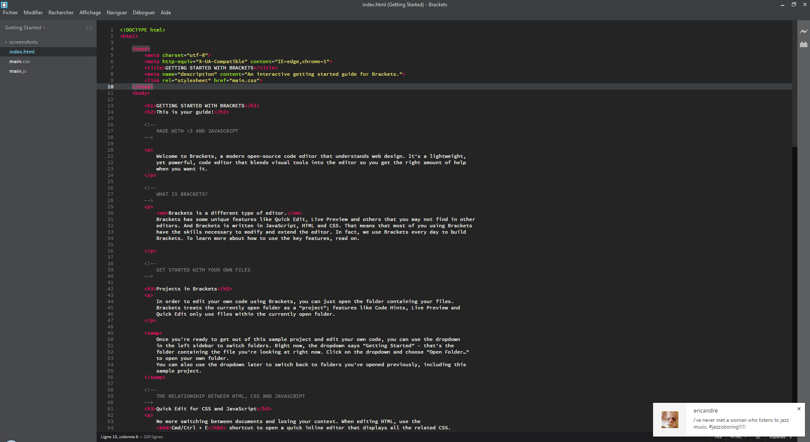
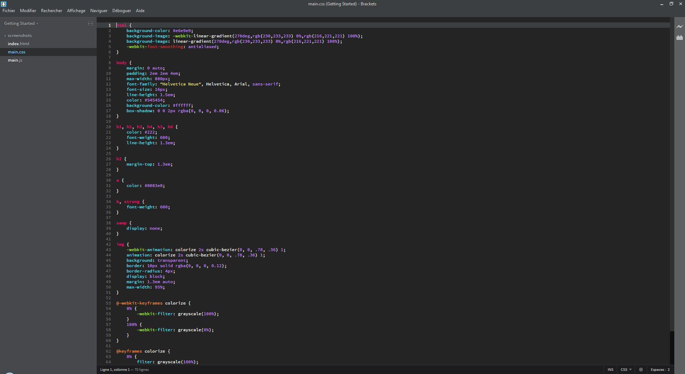
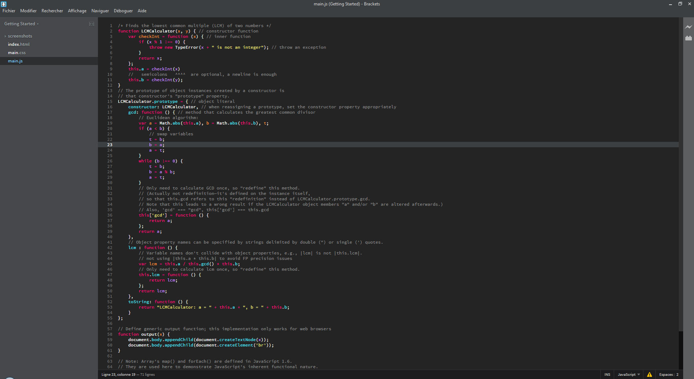

Brackets Theme: Monokai Dark Soda
===

This theme is based on the _monokai dark soda_ color scheme from [Sublime Text](http://sublimetext.com/).

Screenshots
---

### HTML

### CSS

### JavaScript

Installation
---

This extension requires Brackets Release 43 or newer.

1. Open Brackets
2. Open the extension manager
3. Search for ‘Monokai Dark Soda’
4. Click install

License
---

The MIT License. Read [LICENSE](LICENSE) for further information.
